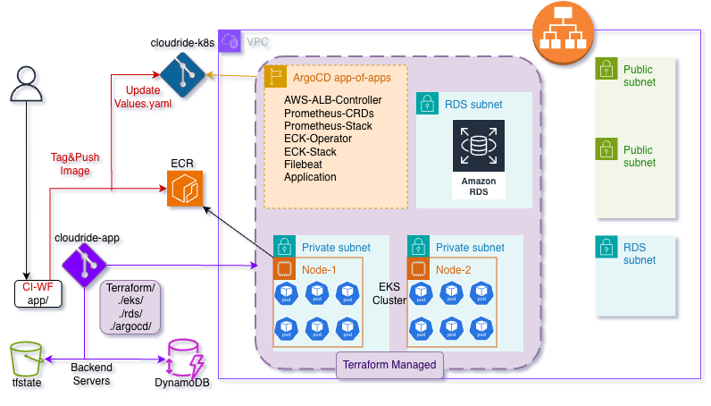

# ☁️ CloudRide Application Deployment

This project provides the Infrastructure as Code (IaC) to deploy the CloudRide application on **Amazon EKS** (Elastic Kubernetes Service), including its associated resources like an **Amazon RDS** database and **ArgoCD** for GitOps-driven application deployment.

The project is structured into two main components:
1.  **`app` folder**: Contains the application source code (**Python files**) and dependencies (`requirements.txt`).
2.  **`terraform` folder**: Contains the IaC (Terraform files) for provisioning all AWS infrastructure.

Application deployment is managed by a separate Kubernetes repository located here: [https://github.com/liormilliger/cloudride-k8s.git](https://github.com/liormilliger/cloudride-k8s.git)

---

## 🛠️ Pre-requisites

To successfully deploy this project, you will need the following:

* **AWS Account**: An active AWS account with appropriate permissions to create EKS, RDS, IAM, and other related resources.
* **AWS CLI**: Configured and authenticated locally.
* **Terraform**: Installed (v1.x recommended) for infrastructure management.
* **`kubectl`**: Installed to interact with the EKS cluster after deployment.
* **`helm`**: Installed (if you need to manually interact with the Helm charts in the K8s repo).
* **GitHub Personal Access Token (PAT)**: Required by the ArgoCD module to clone and read the application's Kubernetes configuration repository ([https://github.com/liormilliger/cloudride-k8s.git](https://github.com/liormilliger/cloudride-k8s.git)).
* **Terraform Backend Setup**: Before running Terraform, you must **create an S3 bucket** and a **DynamoDB table** to store the Terraform state and manage state locking.
* **ECR Repository**: An **Amazon ECR repository** must be created where the CI pipeline will push the built application container image.

---

## 🚀 How to Operate (Terraform Deployment)

The infrastructure deployment should be executed in **two sequential stages**. This ensures the RDS endpoint and EKS cluster are fully provisioned before ArgoCD is deployed to connect the systems.

### 1. Stage 1: Provision Core Infrastructure (RDS and EKS)

This stage provisions the core infrastructure, including the EKS cluster, its worker nodes, and the new RDS database.

**What is deployed:**

* **RDS Module**: Takes a snapshot of an existing RDS instance (for safety/backup) and deploys a **new RDS instance** for the application's use. It outputs the new RDS endpoint.
* **EKS Module**: Provisions the EKS cluster. Key configurations seen in the IaC include:
    * [cite_start]**EKS Cluster Name**: Defined by the `var.cluster_name`[cite: 13].
    * [cite_start]**Worker Node Security Group (`eks_node_sg`)**: Allows ingress from the **cluster's own VPC CIDR block** on ports **80 (HTTP)** and **443 (HTTPS)** for internal traffic[cite: 3].
    * [cite_start]**Worker Node IAM Role**: Attached policies include `AmazonEKSWorkerNodePolicy`, `AmazonEKS_CNI_Policy`, and `AmazonEC2ContainerRegistryReadOnly`[cite: 8].
    * [cite_start]**AWS EBS CSI Driver**: Installed as an EKS Add-on for storage management[cite: 6].
    * [cite_start]**Core Add-ons**: `kube-proxy`, `coredns`, and `vpc-cni` are installed[cite: 6].

**Execution Steps:**

1.  Navigate to the Terraform directory:
    ```bash
    cd terraform/
    ```
2.  Initialize Terraform:
    ```bash
    terraform init
    ```
3.  Target only the RDS and EKS modules for the first apply:
    ```bash
    # Replace 'rds_module' and 'eks_module' with your actual module names if different
    terraform apply -target=module.rds_module -target=module.eks_module
    ```

### 2. Stage 2: Deploy ArgoCD and Application Configuration

After Stage 1 is complete, the necessary endpoints and cluster details are available. This stage deploys ArgoCD and the application configuration.

**What is deployed:**

* **ArgoCD Module**:
    * Deploys **ArgoCD** onto the newly provisioned EKS cluster.
    * Deploys the **App-of-Apps** configuration, which points to the **CloudRide K8s repository** ([https://github.com/liormilliger/cloudride-k8s.git](https://github.com/liormilliger/cloudride-k8s.git)).
    * Uses a **GitHub PAT** (passed via a variable/secret) to enable ArgoCD to clone the private K8s repository.
    * The **RDS endpoint and credentials** are passed securely to the application within the cluster (e.g., as Kubernetes Secrets) to enable connection to the new database.

**Execution Steps:**

1.  Apply the rest of the configuration (the ArgoCD module):
    ```bash
    terraform apply
    ```
    *(If you only had a dedicated ArgoCD module, you could use `-target=module.argocd_module`.)*

---

## 🔄 CI/CD Flow

The project is set up with a GitOps-based Continuous Integration/Continuous Deployment (CI/CD) workflow:

1.  **Code Push (CI Trigger):**
    * Any push (commit) to the **`app` folder** in this repository triggers the Continuous Integration (CI) pipeline.
2.  **Image Build & Test:**
    * The CI pipeline builds the Python application image.
    * It runs any configured tests.
3.  **Tagging and Push to ECR:**
    * The pipeline tags the new image with the **build number** (e.g., `123`, `124`).
    * The tagged application image is pushed to the **Elastic Container Registry (ECR)**.
4.  **GitOps Synchronization (CD Trigger):**
    * The CI pipeline then automatically updates the **image tag** in the application deployment file (e.g., `deployment.yaml` or a Helm `values.yaml`) located in the **CloudRide K8s repository** ([https://github.com/liormilliger/cloudride-k8s.git](https://github.com/liormilliger/cloudride-k8s.git)).
    * This change is committed and pushed to the K8s repository.
5.  **ArgoCD Deployment:**
    * **ArgoCD**, which is constantly listening to the K8s repository, detects the change in the image tag.
    * It automatically pulls the updated configuration and deploys the **new image** version to the EKS cluster, completing the Continuous Delivery (CD) process.

This process ensures that the infrastructure remains separate from the application configuration, and all deployments are managed declaratively via Git.

---

## 🏛️ Architecture

Below is a visual representation of the deployed infrastructure and its components.


