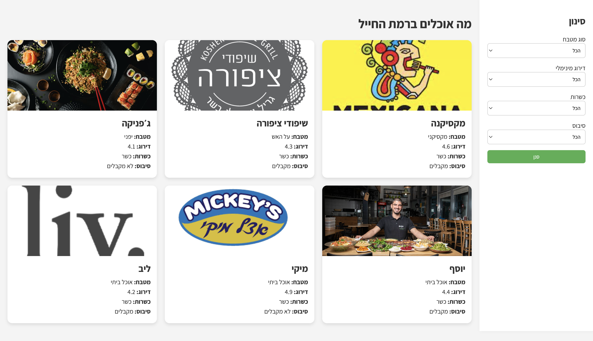

# Ramat Ha-hayal Restaurants

A minimalist Flask web app that lists restaurants in the Ramat Hahayal area (Tel Aviv) with filtering options by:

- Cuisine type
- Minimum rating
- Kosher status
- Cibus (employee meal card) acceptance

Supports **light/dark mode** via environment variable.

---

## 📸 Screenshot

  

---

### 🐘 Use External PostgreSQL

1. Set the following environment variables (you can find it in AWS secret-manager):
   ```env
   DB_ENDPOINT=your-db-hostname
   DB_PASSWORD=your-db-password
   DB_USER=your-db-username
   DB_NAME=restaurants
   ```

---


Made with ❤️ for food lovers working in Ramat Hahayal.
